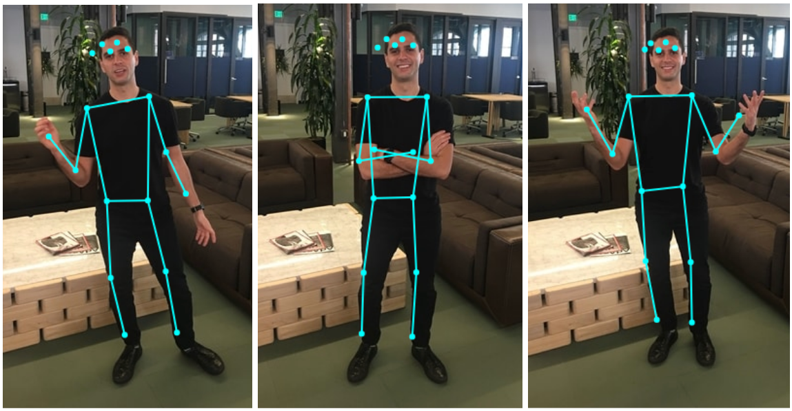

# Pose Detection in the Browser: PoseNet Model

## Note: This program registers and time the body postures to be able to output statistics where time duration of each emotion is detected as well as counted each time when conditions are met.

This package contains a standalone model called PoseNet, as well as some demos, for running real-time pose estimation in the browser using ml5.js.



The main goal of this program was to detect poses, and use them for detecting emotions by body poses.

## Documentation Note

>> The README you see here is to cover pose estimation: finding the keypoints of person's pose and skeleton using the pre-trained machine learning model PoseNet (in JavaScript with p5.js and ml5.js). 

## Installation

You can use this as standalone es5 bundle like this:

```html
  <script src="p5.min.js"></script>
  <script src="p5.dom.min.js"></script>
  <script src="ml5.min.js" type="text/javascript"></script>
```

## Usage
Only 17 keypoints may be used. 


### Requirements
 * Visual Studio Code
 * Browser and Laptop :)


### Keypoints

All keypoints are indexed by part id.  The parts and their ids are:

| Id | Part |
| -- | -- |
| 0 | nose |
| 1 | leftEye |
| 2 | rightEye |
| 3 | leftEar |
| 4 | rightEar |
| 5 | leftShoulder |
| 6 | rightShoulder |
| 7 | leftElbow |
| 8 | rightElbow |
| 9 | leftWrist |
| 10 | rightWrist |
| 11 | leftHip |
| 12 | rightHip |
| 13 | leftKnee |
| 14 | rightKnee |
| 15 | leftAnkle |
| 16 | rightAnkle |


## How to run?

In order to run index.html, you have to right click a html file and open it in your browser. In order to edit, you can use vsCode, or any other html and js editors with live inteface Server.

## Code in Sketch.js

The main algorithm that was used:
```javascript
            if ((pose.keypoints[9].position.y || pose.keypoints[10].position.y) < (pose.keypoints[0].position.y)){
                document.getElementById("emotion").innerHTML = happy();
                document.getElementById("seconds1").innerHTML = happy_seconds();
                document.getElementById("count1").innerHTML = happy_count();
            } else if (pose.keypoints[9].position.x > pose.keypoints[5].position.x &&
                       pose.keypoints[10].position.x < pose.keypoints[6].position.x &&
                       pose.keypoints[9].position.y > pose.keypoints[7].position.y &&
                       pose.keypoints[10].position.y > pose.keypoints[8].position.y) {
                document.getElementById("emotion").innerHTML = angry();
                document.getElementById("seconds2").innerHTML = angry_seconds();
                document.getElementById("count2").innerHTML = angry_count();
            } else if (pose.keypoints[9].position.x > pose.keypoints[7].position.x &&
                       pose.keypoints[10].position.x < pose.keypoints[8].position.x &&
                       pose.keypoints[9].position.y < pose.keypoints[7].position.y &&
                       pose.keypoints[10].position.y < pose.keypoints[8].position.y) {
                document.getElementById("emotion").innerHTML = sad();
                document.getElementById("seconds3").innerHTML = sad_seconds();
                document.getElementById("count3").innerHTML = sad_count();
            } else if (pose.keypoints[9].position.x < pose.keypoints[5].position.x &&
                       pose.keypoints[10].position.x > pose.keypoints[6].position.x &&
                       pose.keypoints[9].position.y < pose.keypoints[7].position.y &&
                       pose.keypoints[10].position.y < pose.keypoints[8].position.y) {
                document.getElementById("emotion").innerHTML = scary();
                document.getElementById("seconds4").innerHTML = scary_seconds();
                document.getElementById("count4").innerHTML = scary_count();
            } else {
                document.getElementById("emotion").innerHTML = "No Emotions";
            }              
```

## Okay, that's it, good luck!
